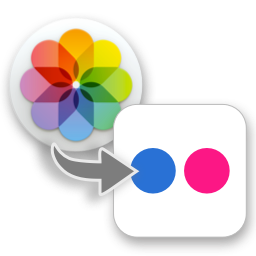

Photos to Flickr
================

Menulet for uploading Mac OS X Photos to Flickr.

Provided as-is, with no warranty that it'll be working as expected. 

Warning, it might even delete elements from your Flickr account! 

Libraries / Pods Used
---------------------

* [objectiveflickr](https://github.com/lukhnos/objectiveflickr) to communicate with the [Flickr API](https://www.flickr.com/services/api/)
* [ReactiveCocoa](https://github.com/ReactiveCocoa/ReactiveCocoa) to make the code reactive
* [Underscore.m](http://underscorem.org/) for functional programming i.e. applying map/reduce operations to arrays

Design - Signals
----------------

    operationsToPerformSignal = mediaObjectsLoadedSignal.map(determineOperationForMediaObject)
    
    flickrUploaderReadySignal = everySecondSignal.zip(previousOperationDoneSignal);
    
    operationsToPerformSignal.zip(flickrUploaderReadySignal).subscribeNext(operation, ready) {
        operation.execute();
    }

Design - Operations
-------------------

                                        +----------------+
                                        | P2FOperation   |
                                        |----------------|
                                        | execute()      |
                                        | getSizeBytes() |
                                        | getBytesDone() |
                                        | isExecuted()   |
                                        +----------------+
                                                 ^
                                                 |
                 /—————————––––––––––––––––––––––+––––––––––––––––––––––––––––-\
                 |                               |                             |
    +--------------------------+   +--------------------------+   +--------------------------+
    | P2FUploadMediumOperation |   | P2FUpdateMediumOperation |   | P2FUpdateFolderOperation |
    |--------------------------|   |--------------------------|   |--------------------------|
    |                          |   |                          |   |                          |
    |––––––––––––––––––––––––––|   |--------------------------|   |--------------------------|
    |                          |   |                          |   |                          |
    +--------------------------+   +--------------------------+   +--------------------------+

Design - Progress Indication
----------------------------

Progress computation:

* Goal: Progress indication with time remaining (e.g. 1:20 hour remaining)
* Assumption: Stable network connection
* Percent indication over total size in MB
* Use pic size in MB
* Consider 0.05 MB for all other requests
* Display "Estimating time remaining" until first MB uploaded
* Time remaining computed using average throughput during time elapsed

Operations performed:

* Fetch picture list from Flickr, including metadata
  - Max. 500 pics / request (Flickr API limit)
  - Progress can be computed only after this operation
  - Status indication: "Getting picture list from Flickr..."

* For new pics & pics changed since last upload: Upload pictures and set metadata
  - Upload order: oldest first
  - Use size in MB for determining progress
  - Progress indication: "Uploading Photos to Flickr..." + overall time remaining
  - Debug info: Uploading <pic-name>: <each> MB of <size> MB uploaded + (<Overall> % completed)

* For existing pics: Update pic metadata if changed
  - Progress indication: "Uploading Photos to Flickr..." + overall time remaining
  - Debug info: Updating <pic-name> (<index> of <pic count>) + (<Overall> % completed)

* Create albums & assign pics to albums
  - Progress indication: "Uploading Photos to Flickr..." + overall time remaining
  - Debug info: Updating album <album-name> (<index> of <album count>) + (<Overall> % completed)

* Sort albums: Out of scope

* Done!
  - Progress indication: "Last upload to Flickr on dd.mm.yyyy hh:mm"

Status bar:
* One-line progress indication
* Button to upload now / Button to abort

Backlog
-------

Medium priority:
- Feature: Delete picture from Flickr if it was deleted from Photos
- Feature/Bugfix: Error handling, e.g. when pic can't be uploaded
- Feature: Update existing pics
- Feature: Automatically upload to Flickr whenever media library is updated
- Feature: Persist and display last upload completion timestamp (x minutes ago)
- Bugfix: Progress shouldn't freeze when menulet is open

Low priority:
- Refactor: Make FlickrClient reactive/asynchronous (not only its upload method)
- Feature: Sort albums
- Refactor: Extract method for duplicate code in PhotosClient
